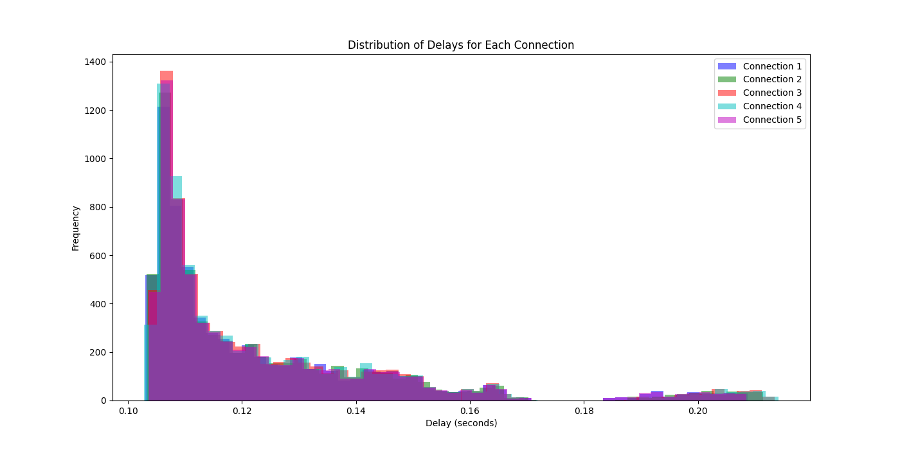

## Анализ результатов

### Гистограмма задержек

Ниже приведена гистограмма задержек для каждого из пяти коннекшенов к серверу Binance.

### Выводы
0.	Визуальное сравнение гистограммы задержек:
   Все пять гистограмм похожи друг на друга с одним или несколькими пиками и хвостами, что указывает на схожий характер данных. Пики гистограмм распределены примерно одинаково, что говорит о схожести центральных значений и разброса данных между выборками.В гистограммах нет выбросов или аномалий, которые могли бы существенно искажать распределение данных.
Такой результат может быть обусловлен несколькими причинами:
1.	Каждое соединение с сервером Binance использует разные сетевые маршруты и может иметь разное физическое расположение серверов, что влияет на задержку передачи данных.
2.	Нагрузка на серверы и сетевые узлы Binance также влияет на скорость передачи данных и может вызывать небольшие различия в задержках.
3.	Различные настройки сетевых протоколов, таких как TCP/IP, могут влиять на эффективность передачи данных и создавать небольшие различия в задержках.
4.	Временные изменения в сети или на серверах Binance могут вызывать кратковременные колебания в задержках между соединениями.
Таким образом, незначительные различия в задержках между коннекшенами могут объясняться вышеуказанными факторами, несмотря на отсутствие статистически значимой разницы в математических ожиданиях и дисперсиях выборок данных о задержках сообщений.
1.	Статистическое сравнение гистограммы задержек:
   1.	Средние задержки:
      Средние значения задержек для каждого из пяти коннекшенов составляют примерно 0.123 секунды. Различия между средними значениями минимальны, что указывает на схожесть времени ответа сервера Binance для всех коннекшенов.
   2.	Стандартные отклонения задержек:
      Стандартные отклонения задержек также показывают малые различия между коннекшенами, находясь в диапазоне от 0.022 до 0.023 секунды. Это указывает на схожесть вариабельности времени ответа между коннекшенами.
   3.	ANOVA тест:
      Результаты однофакторного дисперсионного анализа (ANOVA) показывают, что нет статистически значимых различий между средними значениями задержек у разных коннекшенов. Это подтверждает, что выбранные коннекшены имеют схожие временные характеристики ответа сервера.
   4.	Levene тест:
      Результаты теста Левена показывают, что нет статистически значимых различий в дисперсии (вариабельности) задержек между коннекшенами. Это указывает на равенство вариабельности времени ответа сервера между коннекшенами.
   5.	Доли быстрых апдейтов:
      Значения доли быстрых задержек для каждого из коннекшена от 1 по 5 соответственно: 0.40097044552271727, 0.34847816497573886, 0.036318188501690926, 0.15512424643434788, 0.05910895456550507
      Доли быстрых апдейтов для каждого коннекшена показывают различия в частоте получения первых новых updateId. Например, коннекшен 1 и 2 имеют более высокую долю быстрых апдейтов (порядка 35-40%), в то время как остальные коннекшены имеют существенно меньшую долю, что может быть связано с разными характеристиками сетевого подключения.
